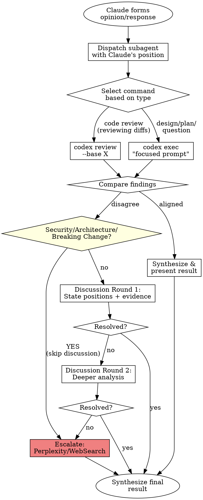

# Codex Peer Review

Peer validation system using OpenAI Codex CLI. Validates Claude's designs and code reviews through structured discussion before presenting to user.

**Core principle:** Two AI perspectives catch more issues than one. When they disagree, structured discussion resolves most issues. External research (Perplexity if available, otherwise WebSearch) arbitrates persistent disagreements.

## Reference Files

@discussion-protocol.md
@escalation-criteria.md
@common-mistakes.md

## Modes of Operation

### Mode 1: Auto-Trigger (Validation Only)

**Triggers before Claude presents:**
- Implementation plans or designs
- Code review results
- Architecture recommendations
- Major refactoring proposals

**Behavior:** Validates existing work, does not create from scratch.

### Mode 2: Slash Command (Full Lifecycle)

```
/codex-peer-review              # Review current changes
/codex-peer-review --base main  # Review against specific branch
/codex-peer-review [question]   # Validate answer to broad question
```

**Behavior:** Can both create and validate reviews/designs.

## Workflow



**Immediate Escalation:** Security concerns, architecture conflicts, breaking changes, or order-of-magnitude performance disagreements skip discussion and escalate directly. See @escalation-criteria.md for details.

## Subagent Dispatch

**CRITICAL:** Always use subagent to avoid context pollution. Never run Codex in main context.

### Command Selection (IMPORTANT)

| Validation Type | Command | Use When |
|-----------------|---------|----------|
| **Code Review** | `codex review --base X` | Reviewing actual code changes (diffs) |
| **Design/Plan Validation** | `codex exec "..."` | Validating proposals, designs, refactoring plans |
| **Question Answering** | `codex exec "..."` | Answering broad technical questions |
| **Architecture Review** | `codex exec "..."` | Validating architecture recommendations |

**DO NOT** use `codex review` to validate designs/plans - it reviews the entire diff, not your proposal.

### Validation Subagent

Dispatch via Task tool with prompt:

```
You are validating Claude's analysis using OpenAI Codex CLI.

## Claude's Position
[Claude's findings/design/recommendations]

## Scope
- Type: [code-review|design|architecture|question]
- Files: [relevant files - be specific!]

## Task - CHOOSE THE RIGHT COMMAND

### If Type is "code-review" (reviewing actual code changes):
Run: codex review --base [branch]

### If Type is "design", "architecture", or "question":
Run: codex exec with focused prompt:

codex exec "Validate this [design|refactoring plan|architecture proposal]:

[Summarize Claude's specific proposal in 2-3 sentences]

Files affected: [list specific files]

Check for:
- Architecture issues
- Potential problems with this approach
- Better alternatives
- Missing considerations

Provide specific, actionable feedback."

## Compare and Classify
After running the appropriate command:
1. Compare Codex output to Claude's position
2. Classify: agreement | disagreement | complement

## If Uncertain Before Running Codex
Check external sources first. Try Perplexity if available, otherwise use WebSearch:

```bash
# Option 1: If Perplexity MCP is available
mcp-cli call perplexity/perplexity_ask '{"messages":[{"role":"user","content":"[your uncertainty]"}]}'

# Option 2: If Perplexity is not available, use WebSearch tool
# WebSearch query: "[your uncertainty]"
```

## Return Format
{
  "outcome": "agreement|disagreement|complement",
  "codex_findings": [...],
  "alignment": {
    "agreed": [...],
    "unique_to_claude": [...],
    "unique_to_codex": [...]
  },
  "discussion_needed": boolean,
  "discussion_topics": [...]
}
```

### Discussion Subagent

**IMPORTANT:** Use Codex session IDs to maintain conversation context across discussion rounds. This allows Codex to remember prior discussion context.

#### Round 1 (Initial Discussion)

```
Discussion Round 1

## Claude's Position
[Current stance with evidence]

## Prerequisites Check
First, verify tools are available:
- Check codex: `which codex || echo "ERROR: codex CLI not installed"`
- Check jq (optional but recommended): `which jq || echo "WARNING: jq not available, will use grep fallback"`

## Task
1. Create temp file in a safe location:
   TMPFILE="${TMPDIR:-/tmp}/codex_round1_$$.json"

2. Run codex exec with --json to capture session ID:

   codex exec --json "Given this disagreement about [topic]:

   Claude's position: [summary with evidence]

   Provide your evidence-based reasoning. Reference specific code or conventions.
   What is your position and why?" 2>&1 | tee "$TMPFILE"

3. Extract session ID for Round 2 (with fallback):
   # Primary method (requires jq)
   if command -v jq &>/dev/null; then
     SESSION_ID=$(jq -r 'select(.type=="thread.started") | .thread_id' "$TMPFILE" | head -1)
   else
     # Fallback: grep for thread_id
     SESSION_ID=$(grep -o '"thread_id":"[^"]*"' "$TMPFILE" | head -1 | cut -d'"' -f4)
   fi

   # Verify we got a session ID
   if [ -z "$SESSION_ID" ]; then
     echo "WARNING: Could not extract session ID. Round 2 will start fresh."
   fi

4. Parse Codex response and attempt synthesis

## Return Format
{
  "session_id": "[thread_id or null if extraction failed]",
  "codex_response": "...",
  "resolution_possible": boolean,
  "proposed_synthesis": "...|null",
  "remaining_disagreement": "...|null",
  "recommend_escalation": boolean
}
```

#### Round 2 (Continued Discussion)

```
Discussion Round 2

## Task
1. Resume the previous Codex session (if session ID available):
   TMPFILE="${TMPDIR:-/tmp}/codex_round2_$$.json"

   # If we have a session ID, resume; otherwise start fresh with context
   if [ -n "$SESSION_ID" ]; then
     codex exec resume "$SESSION_ID" --json "Claude responds to your points:

     [Claude's Round 2 response with new evidence]

     Can we reach synthesis? What is your final position?" 2>&1 | tee "$TMPFILE"
   else
     # Fallback: Start fresh but include Round 1 context in prompt
     codex exec --json "Continuing discussion about [topic]:

     Round 1 summary:
     - Claude's position: [summary]
     - Codex's position: [summary from Round 1]

     Claude's Round 2 response: [new evidence]

     Can we reach synthesis? What is your final position?" 2>&1 | tee "$TMPFILE"
   fi

2. Parse Codex response
3. Determine if resolved or needs escalation

## Return Format
{
  "session_id": "[thread_id or null]",
  "session_resumed": boolean,  // false if fallback was used
  "codex_response": "...",
  "resolution_possible": boolean,
  "proposed_synthesis": "...|null",
  "remaining_disagreement": "...|null",
  "recommend_escalation": boolean
}
```

**Why session IDs matter:** Without resuming the session, Codex starts fresh and loses context from Round 1. The fallback (re-providing context) works but is less efficient and may lose nuance.

### Arbitration Subagent

When escalating for external research/arbitration:

```
Escalate for external arbitration.

## Disagreement Context
- Topic: [specific technical question]
- Claude's position: [with evidence]
- Codex's position: [with evidence]
- Why unresolved: [summary of discussion]

## Task - Choose Available Method

### Option 1: If Perplexity MCP is available
1. Check schema: mcp-cli info perplexity/perplexity_ask
2. Call Perplexity with neutral framing:
   mcp-cli call perplexity/perplexity_ask '{
     "messages": [
       {"role": "system", "content": "You are a senior software architect arbitrating between two AI code reviewers. Provide definitive guidance based on industry best practices."},
       {"role": "user", "content": "[Neutral presentation of both positions with context]"}
     ]
   }'

### Option 2: If Perplexity is NOT available
1. Use WebSearch tool with a focused query:
   - Query: "[specific technical question] best practices [language/framework]"
2. Search for authoritative sources (official docs, well-known engineering blogs)
3. Synthesize findings from multiple sources

## Apply ruling to synthesis

## Return Format
{
  "arbitration_source": "perplexity|websearch",
  "ruling": "...",
  "sources": ["..."],  // URLs if from WebSearch
  "recommended_action": "...",
  "final_synthesis": "...",
  "confidence": "high|medium"  // medium if WebSearch results were inconclusive
}
```

## Codex CLI Commands

### For Code Review (reviewing actual diffs)

**IMPORTANT:** If the base branch is not explicitly provided, you MUST use the `AskUserQuestion` tool to ask the user which branch to compare against. Do NOT guess or auto-detect the base branch.

```yaml
# Use AskUserQuestion to determine base branch
question: "Which branch should I compare against for the code review?"
header: "Base branch"
options:
  - label: "main"
    description: "Compare against the main branch"
  - label: "develop"
    description: "Compare against the develop branch"
  - label: "master"
    description: "Compare against the master branch"
# User can also select "Other" to provide a custom branch name
```

**Passing Focus Context:** If Claude's review focused on specific areas (e.g., security, a particular module, error handling), pass this context to Codex so both reviews are aligned.

Once the base branch is confirmed:
```bash
# Basic review against a branch
codex review --base [user-confirmed-branch]

# With focus instructions (RECOMMENDED - keeps Codex aligned with Claude's review focus)
codex review --base [user-confirmed-branch] "Focus on [Claude's review area, e.g., security in the auth module]"

# Review uncommitted changes only
codex review --uncommitted "Focus on [area]"

# Review a specific commit
codex review --commit [SHA] "Focus on [area]"

# Read instructions from stdin (useful for longer prompts)
echo "Focus on security vulnerabilities and error handling in the authentication flow" | codex review --base main -
```

**Key:** Always pass Claude's review focus (e.g., "security in authentication flow", "error handling in API endpoints", "the UserService refactoring") to Codex so both AIs examine the same areas.

### For Design/Plan Validation (NOT code review!)
```bash
# Validate a refactoring proposal
codex exec "Validate this refactoring plan for the data processor module: Extract 3 classes (Validator, Parser, Invoker) to fix SRP violation. Is this appropriate? What are the risks?"

# Validate architecture recommendation
codex exec "Review this architecture decision: Use event-driven pattern for notification system instead of direct calls. Context: [language/framework] with dependency injection. Check for issues."

# Answer a broad technical question
codex exec "In a multi-module project, should shared DTOs go in the common module or a dedicated api-contracts module? Consider: compile dependencies, versioning, encapsulation."
```

**REMEMBER:** `codex review` reviews the entire git diff. `codex exec` validates a specific proposal.

## Output Formats

### Agreement
```markdown
## Peer Review Result
**Status:** Validated
**Confidence:** High (both AIs aligned)

[Synthesized recommendations with both perspectives merged]
```

### Resolved Disagreement
```markdown
## Peer Review Result
**Status:** Resolved through discussion

**Initial Positions:**
- Claude: [position]
- Codex: [position]

**Resolution:** [how resolved, which evidence won]

**Final Recommendation:** [synthesized view]
**Confidence:** Medium-High
```

### External Research Arbitration
```markdown
## Peer Review Result
**Status:** Escalated for external research
**Source:** [Perplexity | WebSearch]

**Disagreement:** [nature of conflict]

**Research Findings:** [authoritative answer]
**Sources:** [URLs if from WebSearch]

**Final Recommendation:** [based on findings + context]
**Confidence:** High (expert arbitration) | Medium (if WebSearch was inconclusive)
```

## Prerequisites

**Before using this skill, verify the following:**

```bash
# 1. Check if Codex CLI is installed
if ! command -v codex &>/dev/null; then
  echo "ERROR: Codex CLI not installed."
  echo "Install with: npm i -g @openai/codex"
  echo "Or via Homebrew: brew install openai-codex"
  exit 1
fi

# 2. Check authentication status
codex login --check 2>/dev/null || {
  echo "WARNING: Codex may not be authenticated."
  echo "Run 'codex login' to authenticate."
}

# 3. Optional: Check for jq (improves session ID extraction)
command -v jq &>/dev/null || echo "TIP: Install jq for better JSON parsing: brew install jq"
```

**If Codex CLI is not available:**
- The skill will not work for code review or design validation
- You can still use WebSearch for escalation/arbitration
- Inform the user: "Codex CLI is required for peer review. Please install it with `npm i -g @openai/codex`"

## Quick Reference

| Scenario | Command | Action |
|----------|---------|--------|
| About to present design/plan | `codex exec` | Validate specific proposal |
| About to present code review | `codex review --base X` | Review the diff |
| About to present refactoring proposal | `codex exec` | Validate specific proposal |
| About to present architecture recommendation | `codex exec` | Validate specific proposal |
| User asks broad question | `codex exec` | Answer via focused prompt |
| Codex agrees | - | Synthesize and present |
| Codex disagrees | - | Start discussion protocol |
| Two rounds fail | Perplexity/WebSearch | Escalate for external research |
| Major issue (security/architecture) | Perplexity/WebSearch | Immediate escalation |

**Key distinction:**
- Use `codex review` ONLY when reviewing actual code changes (git diff)
- Use `codex exec` for everything else (designs, plans, questions, recommendations)
